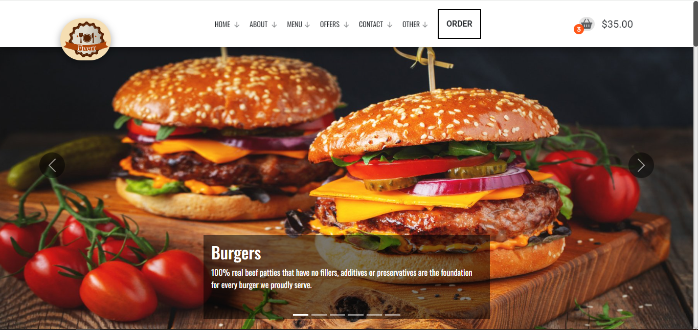

# Fiverr

## Description

This is a static e-commerce webpage created using HTML, CSS, and JavaScript. The webpage features a sleek and modern design with various animations to enhance the user experience. Note that this is a static page, and functionalities like the shopping cart and checkout process are not implemented.

## Features

- **Modern Design**: A clean and attractive design to showcase products.
- **Responsive Layout**: Optimized for both desktop and mobile devices.
- **Animations**: Smooth animations using the AOS (Animate On Scroll) library to improve user interaction.
- **Product Display**: Display products with images, descriptions, and prices.

## Technologies Used

- **HTML**: For structuring the webpage.
- **CSS**: For styling the webpage and creating responsive layouts.
- **JavaScript**: For adding animations and interactive elements.
- **AOS (Animate On Scroll) Library**: For implementing scroll animations.

## Live Demo

Check out the live version of the webpage [here](https://toxn-boybot.github.io/Fiverr/).
